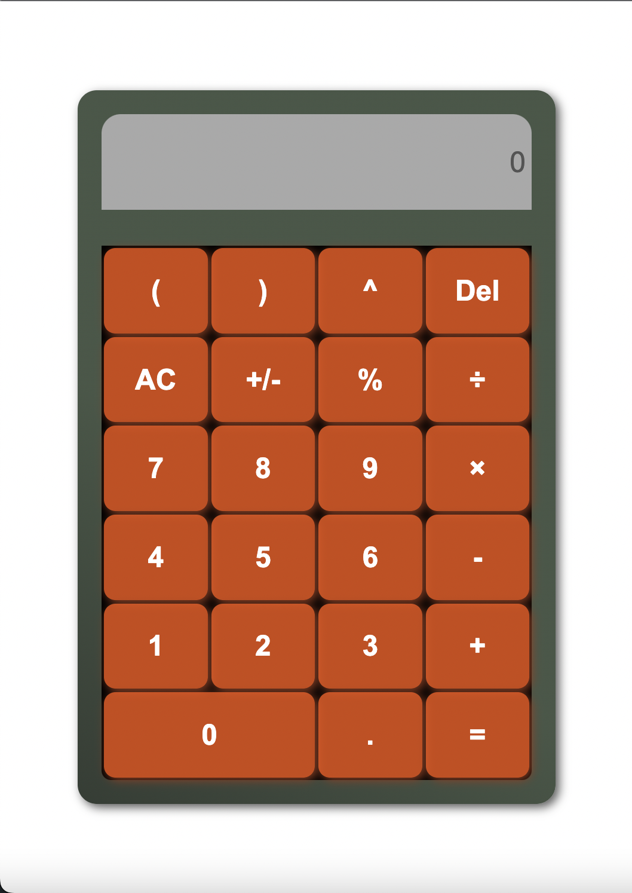

# [Calculadora](https://raymundosantorski.github.io/calc/)

## Está aplicación web es una calculadora que:
- Soporta operaciones como suma, resta, multipliación, división y potencia (también se pueden sacar raices usando potencias inversas).
- Respeta la jerarquía de operaciones.
- Admite el uso de parentesis, incluso anidados.
- Tiene función para convertir porcentajes.
- Incluye botón de cambio de signo.
- Incluye botón All Clear para limpiar la pantalla.
- Acepta operaciones con punto decimal.
- Acepta operaciones con números negativos.
- Filtra los caracteres que no son admitidos, para evitar errores.

## En este proyecto se utilizan diversas herramientas para poder proveer la funcionalidad de calculadora.

- Se utilizan event listeners para saber cuando se presiona una tecla, ya sea con el teclado virtual de la calculadora o el teclado fisico del dispositivo.
- Se utilizan selectores para tener referencias a los elementos html importantes, como 'display' o 'keyboard'.
- Se utilizan arreglos para diversas operaciones, como listar los caracteres admitidos, los operadores validos y también para servir como stack en donde realizo las operaciones.
- Se Utilizan objetos (diccionarios) para tener el peso de cada operador y así poder respetar la jerarquía.
- Se utilizan expresiones regulares para validar las entradas así como para separar toda la operación en sus distintos valores y operadores, para así poder realizar las operaciones de manera adecuada.
- Se utilizan bucles for y while, 'for' para separar los componentes de la operación según sean numeros u operadores y 'while' para realizar las operaciones hasta que se encuentre el resultado.
- Entre otras estructuras del propio del lenguaje javascript.

## Las caracteriticas del proyecto que me gustan son: 

- El archivo html y css son pequeños, pero proveen la estructura y los estilos suficientes para que sea agradable a la vista.
- La implementación del calculo es más corta, elegante y entendible de lo que pensé al principio.
- Las validaciones empleadas proveen un buen control sobre lo que se escribe, por lo que es dificil llegar a tener un error de tecleo al escribir una operación.
- La utilización de expresiones regulares hace bastante simple el proceso de separar los componentes de la operaciones, así como la validación de las mismas.
- El tener la disponibilidad de usar el teclado fisico o el teclado virtual hace que el usuario tenga una mejor experiencia. Por ejemplo si su teclado fisico no sirve al 100% y no detecta la pulsación de algunas teclas, fácilmente se puede utilizar el teclado virtual, a la vez que no se obliga a usar uno o el otro.

## Algunos aspectos a mejorar:

- Los colores de los botones, añadir distintos colores para separarlos según su funcionalidad. 
- Añadir más validaciones, como por ejemplo que se tengan que cerrar todos los parentesis abiertos o manejar las diviones por 0.
- Hacer más modular el código en js para que se entienda mejor y sea más fácil de modificar.
- Encontrar una mejor implementación para solucionar las operaciones con orden jerarquico. 
- Ampliar el número de operaciones que se pueden realizar.
- Entre otras.

## Algunas cosas que aprendí durante este proyecto

- A utilizar expresiones regulares, ya que normalmente solo las buscaba, pero para este proyecto me propuse no buscar directamente la expresión que nacesitaba, si no ir buscando por partes para que funciona cada caracter y así armar por mi mismo mis expresiones, al principio era complicado siquiera pensar en la estructura pero al final se me facilitó más, si bien las expresiones que me vienen a la mente no funcionan a la primera, ahora me es más fácil depurarlas por mi cuenta hasta que cumplan con mis reuqerimientos.
- A realizar mejores busquedas en google, ya que al haber terminos que se utilizan en las expresiones regulares que yo no conocía no podía buscar tan directamente lo que necesitaba, tuve que mejorar al formular mis preguntas para así poder encontrar mejores respuestas en menor tiempo.
- Mejoré mi capacidad de plantear un problema y pensar, modelar, depurar e implementar una solución. No había aplicado está solución antes y no quise buscar en internet, pensé en que era lo que necesitaba resolver para poder realizar operaciones multiples respetando la jerarquía y comencé a pensar en el algoritmo, lo modelé en mi cuaderno, seguí paso a paso el algoritmo en papel hasta encontrar errores para así poder depurarlo y cuando por fin encontré la solución, la implementé en código, tuve diversos errores y depuré nuevamente hasta que funcionó la aplicación.
- Practiqué inglés al tratar de realizar la mayoría de mis busquedas en este idioma.